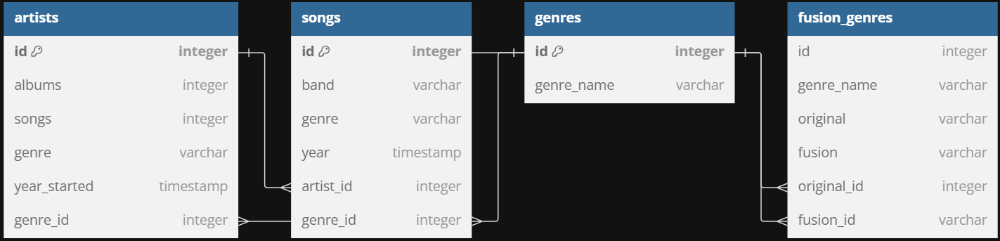
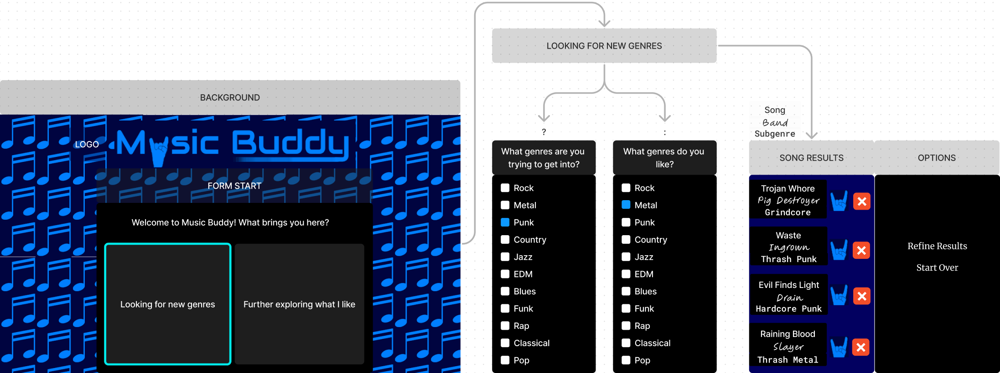

# Project Title

## Overview

Music Buddy recommends music based on the genres people like by picking the top several songs that relate to the criteria people choose depending on what they want to get into.

### Problem

Spotify is a 2-way guessing game. Its recommendations consistently satisfy people but sometimes don't, and it is either costly or obnoxious. Music Buddy will be a simple app that will give people lists of songs to check out based on what they want, and when they find something they like, they can check them out later.

### User Profile

People looking for new music either based on what they like or wanting to check out some new genres

### Features

- Checklists of what genres people like
- Checklists of what genres people want to get into (optional)
- Checklists of what genres people don't want to filter out crap
- (later) Popularity filters to skip mainstream stuff
- Lists of songs based on chosen criteria with respective artists, genres and other basic info

## Implementation

### Tech Stack

- React
- Express
- MySQL
- Client libraries:
    - react-router
    - axios
- Server libraries:
    - express
    - knex
- Maybes:
    - *uuid*
    - *fs*
    - *passport.js*

### APIs

- Start with a small and simple API to get everything working nicely
- *(maybe later)* Incorporate a popular API to give people more options and top results and pick if they want what is or isn't popular

### Sitemap

- Questionnaire to filter down what people might like
- Music List based on filtered and consolidated criteria

### Mockups

### Data

Describe your data and the relationships between them. You can show this visually using diagrams, or write it out. 

### Endpoints

**GET /genres**
- Get all genres

Parameters:
- genre_name

**GET /genres/genre_name**
- Get all bands within a genre

Parameters:
All bands within the specified genre

**GET /genres/genre_name/related**
- Get *(MAYBE top 10)* related to what is chosen

Parameters:
- Everything in /songs

**GET /bands**
- Get all bands

Parameters:
- band_name
- primary_genre
- starting_year
- num_albums
- num_songs
- num_members
- home_country
- member_genders

**GET /bands/band_name/genres
- Get all genres that can relate to any of a band's songs

Parameters:
- genre_name FROM genres
*- subgenre_name*

**GET /bands/:band_name/albums**
- Get all of a band's albums

**GET /songs**
- Get all songs

Parameters:
- song_name
- genre
- subgenre
- band_name

**GET /bands/:band_name/songs**
- Get all songs from a certain band

### Auth

No authentication yet. Thinking of doing that sometime after capstone, but that's quite low priority, so ehh

## Roadmap

- Create database
    - Start with genres I know decently and don't hate. Add fusion genres that relate between those, and maybe throw in some subgenres.
    - Put in the most popular bands from those genres as well as a few key songs people will like
- Create server
    - Get all data from the database
    - Create logic that filters songs/bands(depending on user input) based on choices
- Create client
    - Build the form that will do all of the filtering magic
    - Create the music list page that will get all of the backend queries

## Nice-to-haves

- Filter based on popularity to either get top hits or filter out mainstream crap
- External API to give people any music they could want
- Downloadable local storage for people to check out their recommendations later
- Sampling feature so people can just listen to key parts of a song